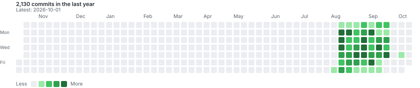

# speed

https://github.com/user-attachments/assets/b0e4f28d-5af5-4dd3-964b-cc9ec8e97234

## Commit activity

Activity from the private repository, shown for the trailing year.

Maintainer setup

The calendar workflow reads commits from the private `swilled/speed` repository and commits the generated SVG to this public repository.

1. Create a fine-grained personal access token that can access only `swilled/speed`, with **Contents: Read-only** permission.
2. In [this repository's Actions secrets](https://github.com/swilled/speed-web/settings/secrets/actions), add a repository secret named `SPEED_REPO_TOKEN` and paste the token value.
3. Run **Update private commit calendar** once from the Actions tab.

The workflow's built-in `GITHUB_TOKEN` has **Contents: Read and write** permission here, so no separate write token is needed.

